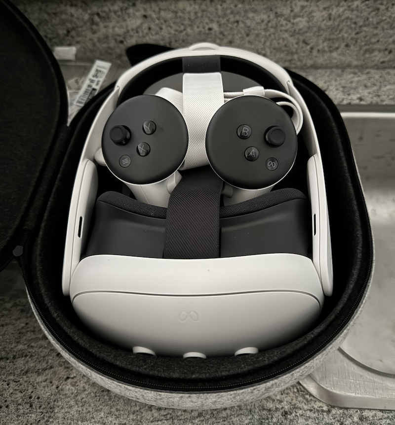
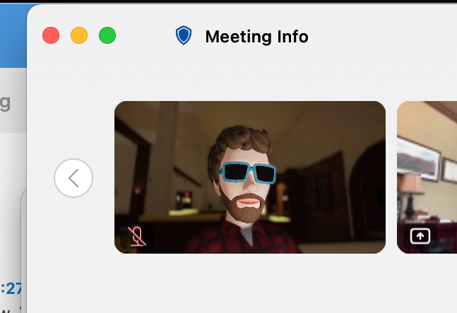

+++
title = "On returning the Quest 3, and thoughts on Apple Vision Pro"
date = "2024-03-16T16:05:11.405Z"
description = "VR has come a long way, but it's still just too isolating for me."
categories = ["gadgets"]
keywords = ["meta", "quest 3", "apple vision pro"]
hasCode = false
+++

A week or so after writing [about passkeys support on the Quest 3]() I had spent enough time with the device to know that it just wasn't meant to be. But while I ultimately packed it all up, brought it back to the store, and put it in my rear view mirror, I still liked some parts of the experience.

Below are lingering thoughts about my time with the Quest 3 and how I think it compares to the Apple Vision Pro (sometimes AVP below) demo I experienced around the same time.

## The Quest 3's upgraded strap is a necessity

The Costco Quest 3 bundle I picked up included the [Carrying Case](https://www.meta.com/quest/accessories/quest-3-carrying-case/) and the [Elite Strap](https://www.meta.com/quest/accessories/quest-3-elite-strap/) accessories. These upgrades were the reason I even paid attention to the bundle. Over the years I've spent slowly upgrading my OG HTC Vive, the upgraded [Vive Deluxe Audio Strap](https://www.vive.com/us/accessory/vive-deluxe-audio-strap/) was the best money I ever spent on it (well, that and the [Wireless Adapter](https://www.vive.com/us/setup/wireless/)) because of how much more comfortable it made the headset:

The headset came on and off effortlessly with the Elite Strap when compared to the floppy elastic band that comes with the headset. The dial used to adjust the fit also made it effortless to share with my wife to give her a taste of "modern VR."

## Passthrough proves the value of AR

The color passthrough really impressed me, especially compared to the Vive's grainy, outlines-only view of the world you could lean on in a pinch. Sure, the Quest 3's passthrough was still grainy, and visual distortions while walking around didn't induce VR nausea but were an obvious area for improvement. That said, being able to position a YouTube video somewhere "in the world" and then continue to see it while walking around like some ethereal flat-screen TV left a positive impression on me. It was also amusing to be able to see and converse with my wife while a video of the Final Fantasy 7 Rebirth demo played off on some wall as I vacuumed while wearing the Quest 3.

VR is great for immersive experiences, but I think passthrough leaves me strongly agreeing that Augmented Reality is where this technology needs to end up before it can become another daily-use technology.

## The screen door effect has significantly diminished

I looked up the screen resolutions of the HTC Vive to compare to the Quest 3, and it's no wonder I had a hard time seeing the pixels in the Quest 3. The HTC Vive is 1080x1200 pixels per eye, while the Quest 3 was *a whopping 2064x2208 pixels per eye.* That's nearly double the number of pixels per eye, assuming the screens are roughly the same physical dimensions. Needless to say, I was quite pleased with the visual fidelity of just about everything in the Quest 3.

One thing that worked against the Quest 3, though, was how eager apps were to only stream both 2D and 3D video at 480p. This included the native YouTube app, as well as Disney+, neither of which gave you an (obvious) option to switch to higher resolutions. It gave the impression that the screens weren't actually that good.

I found out via the [r/OculusQuest](https://www.reddit.com/r/OculusQuest/) subreddit that accessing YouTube in the Quest Browser let you stream content at higher resolutions, including 4K. Once I tried that out the full visual clarity of the hardware could be appreciated. An odd choice by Google and Disney there...

## Hand tracking now feels like table stakes

Outside of VR games I found myself switching to hand tracking as often as I could. Being able to reach out and press buttons on something in front of me in VR was very satisfying. Part of this was the fact that the hand overlay you'd see in VR would stop on surfaces in VR the same way your physical hand stops when pressed against surfaces in the real world. Sure, in the real world my hand would have pressed through the virtual interface, but seeing "your" hand stop made things feel that much more interactive. I'd like it if more VR platforms incorporated this into their experiences.

## VR is still too isolating

I think this is the ultimate reason I returned the Quest 3: in a household with a wife and child, I can't really share any of what I'm enjoying. Part of the fun of media consumption is gasping together with my wife at a sudden plot twist, or rolling our eyes together at some bit of overacting in a show our kid is watching. Or hell, even just showing each other our phones to watch some video on social media. Sure, I could have cast a video feed from the Quest 3 to a TV so my family could see what I was watching, but at that point why not just watch the video on the TV? Not to mention that most content today is 2D, and 3D content is still kind of a mixed bag that doesn't quite justify itself...

One positive experience the Quest 3 did let me try out was working from a computer with multiple virtual screens. Of the couple such apps I tried I settled on [Immersed](https://immersed.com/) for a work session or two. Getting their app up and running took the least amount of work, and their work environments were the nicest to navigate around. They had a weird gamification scheme going on, though, that enticed you to come back consecutive days to unlock more environments. Beyond that I think theirs was the most polished virtual workspace experience.

I was the most pleased at how easy Immersed made it to augment my MacBook Pro's display with virtual screens. I could dedicate each virtual screen to a single window as I used to do in the past when I worked from multiple physical screens. And from macOS' perspective they were simply additional monitors so I could move my cursor around them as expected. That said my ultrawide monitor still reigned supreme for not running out of battery after 45 minutes of work.

Immersed did let me attend a team meeting as my virtual self, which was good for a laugh:

## Comparisons to the Apple Vision Pro

A lot of ink has already been spilled about how the Quest 3 compares to the Apple Vision Pro. This section only contains my impressions of the two, having had access to both pieces of hardware so temporally proximate to each other.

Looking-and-pinching to manipulate the VR environment in the Apple Vision Pro is a more **comfortable** interaction paradigm because your hands are at rest in your lap. But being able to reach out and "directly manipulate" windows with your hands in the Quest 3 feels more **natural**. Sure, the AVP also has hand tracking that lets you hunt-and-peck on a keyboard just like in the Quest 3, but it did less work to prevent you from seeing when your hand would go clear through an interactive element. After the AVP demo I felt that the Quest 3's hand-tracking manipulation was the superior of the two.

I think the AVP wins the screen fidelity battle, but not by much. The AVP's fully immersive environments were prettier compared to the Quest 3's (in a forehead-smackingly "photos are more realistic than stylized 3D game environments" kind of way) sure, but both have tackled the screen door problem to a degree that I was happy it took so much effort to notice the pixels. Remember, I'm coming from an HTC Vive that is basically half the resolution of the Quest 3 so it didn't take much to impress me here.

The FOV of the Quest 3 was wide enough, and the hardware capable enough of keeping up with my head movement, that I barely ever registered the edges of the screen. I noticed the edges of the AVP's screen more than I expected, but maybe because I was looking for them during the demo?

I think in general I agree that the [Apple Vision Pro is a well-designed dev kit](https://hugo.blog/2024/03/11/vision-pro/) that's obviously intended to get people to seed a new Apple ecosystem for future hardware iterations. But right now, as of March 2024, the experiences you can achieve for a "fraction" of the price ($3500 vs $650 MSRP) makes the Quest 3 the better purchase.

## Conclusion

VR can be a lot of fun as evidenced by the number of times I've purchased Beat Saber and its expansions. But I still think this all lacks *something* to make it a required piece of technology in the way that computers and smartphones have achieved.

I'll boldly claim that the Quest 3 has been the *best* VR experience I've had to date. The freedom of movement from being a standalone computer, the higher-quality passthrough video, the satisfying hand tracking, and the phenomenal screen resolution...all of this came together into a really impressive experience compared to my HTC Vive. The Apple Vision Pro is equally as impressive and, for someone like me so heavily bought into the ecosystem, is the one I look the most forward to seeing evolve.

But in the end I had no real way to share any of this with my family beyond giving them the headset to try. This left me wondering if the Quest 3 too would ultimately end up on some shelf just waiting for a truly "killer app" to come by to finally justify its purchase. And right now, even at $650, mainstream VR is still too expensive to accept that as a potential fate.
