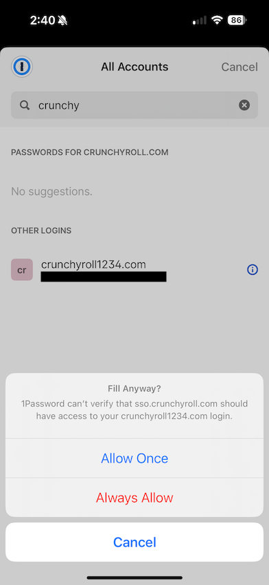

+++
title = "Password managers aren't replacements for passkeys"
date = "2024-10-18T20:58:46.611Z"
description = ""
categories = ["webauthn", "passkeys"]
keywords = ["passkeys", "password managers"]
hasCode = false
+++

There was [some recent discourse](https://world.hey.com/dhh/passwords-have-problems-but-passkeys-have-more-95285df9) about passkeys that bemoaned that they have *so* many issues that it's better to stick with a password manager. The idea is that maintaining strong, unique passwords via a password manager is easier for users to understand. This completely misses the key point about why passkeys are such a stronger way of protecting login, though, so I decided to spend some time to compare the two approaches.

## Password managers do their best

Below is an exhaustive list of the security properties of a website that the browser verifies during a password authentication:

1. The user is on a website

And...that's pretty much it.

Now, let's imagine a password manager has a very strong, unique password stored for the URL the user is currently viewing. The password manager jumps in to autofill the user's credentials if it looks like the URL resembles any entries' "website" fields, and this seems to give the impression that the password can only be autofilled on its matching site.

However, while password managers often try discourage the user from autofilling credentials for a site if the selected entry doesn't match the URL, the user can ultimately force their way through the autofill warning to potentially disastrous results. And even if autofill doesn't work, particularly stubborn users who "just want to get to the website" can manually copy-paste in their strong, unique password. Either way users are still highly susceptible to getting phished.

## Phishing strong, unique passwords

For example, let's imagine that I have a credential saved for a website "**crunchyroll1234.com**":

If an attacker tricks me and tells me to enter my login for crunchyroll1234.com into "**crunchyroll.com**" (this is a low-effort phishing scenario, please bear with me) then 1Password warns me to reconsider auto-filling. But I'm a busy man and I just want to watch my anime so I plow forward with the ceremony because I'm given the option to:

The browser has no idea that the autofilled credentials should not be submitted to the phishing site. The end result is that I'm allowed to have my username and password phished out from under me.

That's pretty messed up!

## It's the phishing resistance, duh!

Passkeys are such a stronger authentication mechanism because **the browser and authenticator are active participants in the ceremony**.

When users register or log in with a passkey, the **browser** is in charge of the following:

1. Checking the user is on a TLS-protected website
2. Ensuring the user consents to the ceremony
3. Optionally confirming the user's ownership of the device
4. Validating that the RP ID makes sense for the site's domain
5. Reporting on which URL a ceremony was completed
6. Returning the authenticator's private-key-signed response

The **authenticator**, meanwhile, has its own active role in all of this:

1. Tracking credentials for a given RP ID
2. Generating and maintaining unique passkeys per RP ID (and user ID)
3. Maintaining the sanctity of the passkey's private key

To summarize a bit here, **the browser makes sure the RP ID is valid for the current URL, and the authenticator only allows use of passkeys that match the validated RP ID.**

These are active protections that enlist the help of tools the user has consented to use (the browser and authenticator) to keep the user safe. Together this nearly eliminates an attacker's ability to induce a potential victim to share their credentials, aka "phishing", via a website that looks like a legitimate website at an illegitimate URL. This is a proven way of eliminating phishing from authentication, and no amount of management of strong, unique passwords will ever be as effective.

## Passkeys are better than ever

Browsers and OS vendors both continue to iterate on communicating the benefits of passkeys, and on making passkeys easier to use. Additionally, new technologies like the FIDO Alliance's [Credential Exchange Protocol and Credential Exchange Format](https://fidoalliance.org/specifications-credential-exchange-specifications/) are coming out soon to allow for passkey private keys to be securely migrated between providers.

The industry as a whole remains committed to enhancing the usability of passkeys, and continue to work tirelessly to address the tougher adoption challenges that remain. However we can all continue to benefit from the phishing resistance of passkeys as an auth method, so now's the time to start acclimating. Password managers still have a place in our world, especially as most of them evolve to become passkey providers as well.

Now is the time to start acclimating to passkeys. Because we'll all be better for it in the long run.
